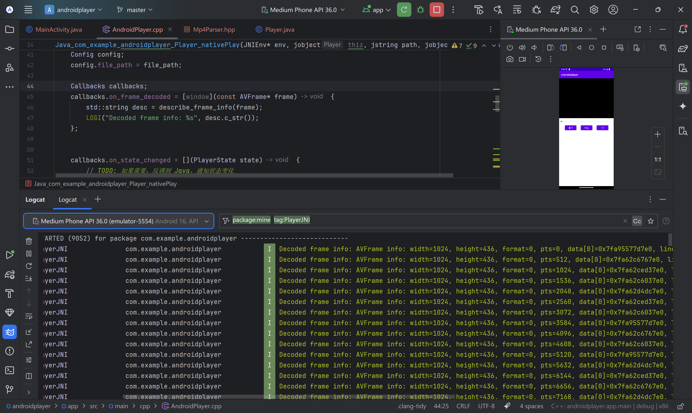

## Day 11

### Part1

(1)在给定的工程当中，补全 native 的 render 函数，使用 opengl 在 AndoidNativeWindow 上展示图片，在手机
屏幕上展示出来图片画面。（80分）

那么首先来看结果：

> 没有安卓手机，所以用模拟器凑合一下


#### 思路

那么 `render` 函数已经把要用 EGL 的事情都做了，只要完成使用 OpenGL 的部分即可，具体来说


```cpp
eglMakeCurrent(display, eglSurface, eglSurface, context);
```

- 这一句把（由 ANativeWindow 创建的） EGLSurface 绑定为当前上下文的前后缓冲区
- 此后所有的 OpenGL 命令就会绘制到这个 EGLSurface 的 back buffer（后缓冲）中。

在最后

```cpp
eglSwapBuffers(display, eglSurface);
```

这一句把刚刚绘制到 back buffer 的内容展示（swap）到屏幕上，即变为前缓冲区，供用户看到。

所以我们只要在设置完上下文和交换 buffer 的中间部分调用  OpenGL 命令即可。

#### 读取图片

这里的读取图片交给 Android 的 `BitmapFactory.decodeResource` 函数完成，我们在 JAVA 桥接函数里把它传给 Native C++ 函数 `render`

> 值得一提的是，给的代码这里写的时候把 `Bitmap` 调整了一下尺寸为和屏幕尺寸一致，照着写的我在后面也调整了一下尺寸。
>
> 结果后面显示的图片一直就是屏幕的比例，看起来很诡异，找了好长时间才发现这里写错了，被自己气笑了😓

`Bitmap` 内部存储的就是 RGBA buffer（unsigned 类型），不过传到 Native C++ 函数时类型信息已经丢失了，所以得用 `AndroidBitmap_lockPixels` 函数取出指向它内部 buffer 的 `void*` 指针

最后我们会将图片通过 `glTexImage2D` 函数绑定到 Texture 上

```cpp
glTexImage2D(GL_TEXTURE_2D, 0, GL_RGBA, imgW, imgH, 0, GL_RGBA, GL_UNSIGNED_BYTE, imgData);
```

图片读取基本就是这样的过程

#### 提供接口

所以，我们要向 Native 函数 `render` 提供这样一个接口：

接受两个图片（前景和后景）的 RGBA buffer 和尺寸，将它们绑定到 texture 上，然后在指定位置以指定尺寸渲染这几个纹理。

```cpp
void GlBitmapRenderer::drawComposite(const ImageDesc &bg, const ImageDesc &fg, int screenWidth,
                                     int screenHeight) {
    utils::updateTexture(bgTexture_, bg.data, bg.imgWidth, bg.imgHeight);
    utils::updateTexture(fgTexture_, fg.data, fg.imgWidth, fg.imgHeight);

    glClearColor(0.0, 0.0, 0.0, 1.0);  // 黑色背景
    glClear(GL_COLOR_BUFFER_BIT);

    // 渲染背景
    utils::renderAt(program_, vao_, bgTexture_, bg,
                    static_cast<float>(screenWidth), static_cast<float>(screenHeight));
    // 渲染前景
    utils::renderAt(program_, vao_, fgTexture_, fg,
                    static_cast<float>(screenWidth), static_cast<float>(screenHeight));

}
```

#### RenderAt 的实现

`renderAt` 使将 img 描述的纹理绘制到指定的屏幕位置（img.posX, img.posY），并进行适当的缩放（img.displayWidth, img.displayHeight）。

它主要做这么几件事：

- 将屏幕像素坐标转换为 NDC 坐标（因为 OpenGL 中的坐标是 NDC 坐标）
- 计算缩放后的 NDC 尺寸、中心偏移位置

然后构造一个变换矩阵

```cpp
float model[16] = {
    ndcDisplayW, 0.0f,        0.0f, 0.0f,
    0.0f,        ndcDisplayH, 0.0f, 0.0f,
    0.0f,        0.0f,        1.0f, 0.0f,
    centerX,     centerY,     0.0f, 1.0f
};
```

这个矩阵

- 将输入缩放为 ndcDisplayW x ndcDisplayH
- 并平移到屏幕中指定位置 centerX, centerY

> 这个列主序矩阵看起来真的好难受

总之，进行转换后就可以渲染了，接下来就是调用 OpenGL API

- 指定 Shader（在 program 中）
- 指定顶点数据 VAO/VBO
- 绑定纹理
- 把变换矩阵传给 shader，让它进行缩放+平移。
- 使用 VAO 中定义的 4 个顶点绘制一个矩形

开启了 Alpha 通道融合，这样结果会好看一些

#### Shader

比较重要的是 vertex shader ，因为需要它来对坐标进行操作，以及整体缩放和平移

``` GLSL
#version 300 es
layout(location = 0) in vec2 aPos;
layout(location = 1) in vec2 aTexCoord;
uniform mat4 uModel;
out vec2 vTexCoord;
void main() {
    vTexCoord = aTexCoord;
    gl_Position = uModel * vec4(aPos, 0.0, 1.0);
}
```

fragment shader 主要是采样纹理，这里就不写了

#### VAO/VBO

创建这样一个 VAO ，然后把它传到 GPU 的 VBO 中

```CPP
inline float vertices[] = {
    -1.0f, -1.0f,  0.0f, 1.0f,
     1.0f, -1.0f,  1.0f, 1.0f,
    -1.0f,  1.0f,  0.0f, 0.0f,
     1.0f,  1.0f,  1.0f, 0.0f 
};
```

每个顶点有 4 个 float 分量：

前两个是位置：x, y（范围是 NDC，即 [-1, 1]）

后两个是纹理坐标：u, v（范围是纹理空间 [0, 1]）

这个 quad 是按行排列的 triangle strip：

```perl

    (−1,1)      (1,1)
      ●────────●
      |       /|
      |     /  |
      |   /    |
      | /      |
      ●────────●
    (−1,−1)    (1,−1)
```

当调用：

```cpp
glBindVertexArray(vao);
glDrawArrays(GL_TRIANGLE_STRIP, 0, 4);
```

它就会：

- 使用 4 个顶点（每个都有位置和纹理坐标）
- 绘制成两个三角形的 strip，形成一个矩形
- 根据传入的纹理坐标，将纹理贴图绘制到这个矩形上

### 文件结构

这次没有动 UI 代码，所以主要就是几个 CPP 程序

> Android Studio 创建 CPP 类默认把头文件和源文件都放在同一个目录下
>
> 所以是它干的，不是我的锅hh

``` Powershell
~/AndroidStudioProjects/coursework-7.20/part1/RenderLib/src/main/cpp
❯ exa -T
.
├── CMakeLists.txt
├── glBitmapRender.cpp
├── glBitmapRender.hpp
├── glDisplayer.cpp
├── glDisplayer.hpp
└── renderlib.cpp
```

所以 `glBitmapRender` 类：

- 在构造函数中初始化 Shader（program）、texture、VAO、VBO
- 在析构时自动释放资源
- 提供一个上述 drawComposite 接口

剩下的函数没有必要放到类里，它们与生命周期无关，所以放在 `glDisplayer::utils` 命名空间中，包括：

- 根据 GLSL 字符串参数创建 Shader
- 调用上面的创建 Shader 创建 program
- 创建 VAO + VBO
- 用图片的 RGBA buffer 更新纹理
- 以及上述的 renderAt 函数


- 此外还在 `renderlib.cpp` 的 render 函数中简单调用上述函数，以及（相当麻烦的试参数）让这俩图的位置合适的计算坐标逻辑
- 在外部 JNI java 桥接类中对 Native 接口暴露一下 `Bitmap` 数据

### Part 2

对程序进行优化，给出优化思路方案和优化结果。(20分)

#### 避免重复创建 OpenGL 资源

在 C++ 层引入 GlBitmapRenderer 类持久化资源，避免每次 render 调用都会重新生成 VAO/VBO、Shader、Program、Texture，带来性能浪费

其实这个类 Part 1最开始写就有了，不过凑个数

> 而且实际上，现在这个应用就是显示两张图片叠起来，整个界面一直没有刷新所以也不会重新触发 `surfaceChanged`，更不用说多次 render 了 
>
> 如果打个 log ，会发现 drawComposite 函数就被调用一次，所以目前的场景下这个玩意儿理论上是不会出现明显性能优化的

#### 另外开一个线程来跑 io

上面开玩笑的，要优化那就先看看 log 




``` bash
2025-07-20 21:45:14.918  4236-4236  Choreographer           com.mi.renderlearn                   I  Skipped 34 frames!  The application may be doing too much work on its main thread.
```

这说明主线程里有些东西做了太多工作，我们用 profiler （System Trace）看看：

先看主线程：


！DecoderBitMap 花了 29.51% 的时钟时间，看来我们应该尝试把这个放到子线程里

原来的部分是这里：

```java
@Override
public void surfaceCreated(@NonNull SurfaceHolder holder) {
    mCarBitmap = BitmapFactory.decodeResource(getResources(), R.drawable.car);
    mTaiyiBitmap = BitmapFactory.decodeResource(getResources(), R.drawable.taiyi);
    mLianhuaBitmap = BitmapFactory.decodeResource(getResources(), R.drawable.lianhua);

    // Add logging to verify the dimensions on the Java side
    Log.d("RenderActivity", "Loaded mCarBitmap dimensions: " + mCarBitmap.getWidth() + "x" + mCarBitmap.getHeight());
    Log.d("RenderActivity", "Loaded mTaiyiBitmap dimensions: " + mTaiyiBitmap.getWidth() + "x" + mTaiyiBitmap.getHeight());
    Log.d("RenderActivity", "Loaded mLianhuaBitmap dimensions: " + mLianhuaBitmap.getWidth() + "x" + mLianhuaBitmap.getHeight());
}
```

用一个子线程执行即可（省略 LOG 函数的调用）

```java
  @Override
  public void surfaceCreated(@NonNull SurfaceHolder holder) {
      Executors.newSingleThreadExecutor().execute(() -> {
          Bitmap fg = BitmapFactory.decodeResource(getResources(), R.drawable.taiyi);
          Bitmap bg = BitmapFactory.decodeResource(getResources(), R.drawable.lianhua);
          Surface surface = holder.getSurface();
          runOnUiThread(() -> render(bg, fg, surface));
          mTaiyiBitmap = fg;
          mLianhuaBitmap = bg;
      });
  }


  @Override
  public void surfaceChanged(@NonNull SurfaceHolder holder, int format, int width, int height) {
      if (mLianhuaBitmap != null && mTaiyiBitmap != null) {
          render(mLianhuaBitmap, mTaiyiBitmap, holder.getSurface());
      }
  }
```

再跑一遍 profiler，可以看到这次 decodeResource 跑在一个单独线程 `pool-4-thread-1` 里，那么这就减轻了主线程的 IO 负担，具体多少取决于图片数量和大小


值得一提的是右上角的主线程那一块应该就是 JNI 调用，因为它正好在 decode 完成后才开始，可以看出它们蛮快的，似乎不占大头，所以我们往左边看

不过很不幸，我们仍能看到 `Skipped 36 frames!  The application may be doing too much work on its main thread.` log，让我们继续观察 profiler

发现主线程左侧最大的一块是 `Choreographer#doFrame`

ask LLM：

> 它的功能是：
> 
> 收集当帧的绘制任务（Measure/Layout/Draw/Render），调度到下一帧 vsync。
>
> 所以：
>
> 如果你看到 Choreographer#doFrame 一直在 trace 里持续存在 → 说明它 卡在等待前面那些绘制任务完成。
> 
> 所以它报出 Skipped XX frames 的根本原因是：它调不动帧，因为前面的任务（decode、IO、绘制等）阻塞了主线程。

所以，看起来 尽管 JNI Native 函数很快，但他还是会阻塞主线程，所以我们干脆把它也放到子线程里

把 `runOnUiThread(() -> render(bg, fg, surface));` 改为直接调用即可

> 其实这个地方我感觉到很怪，按理说这样不需要考虑数据保护问题吗？但他竟然运行的很好
>
> 于是我问 LLM:
> 
> *注意：**如果 render 内部调用了 Android UI 相关接口（如 Canvas、View 操作），需要在 UI 线程调用；如果全部是 Native 层渲染或 OpenGL ES 渲染绑定，这样放子线程是合适的。
>
> 我们的 render 似乎刚好合适呢hh


可以看出这一次 JNI 调用也被放到了子线程里，所以不会阻塞主线程了，肉眼可见的流畅了些

再次回到 logcat


可以看到 `Skipped xx frames!  The application may be doing too much work on its main thread.` log 没有了，说明还是有优化的

优化 IO 阻塞后已经比较流畅，况且 NATIVE render 函数运行的时间本来就挺短，优化 Native 具体实现的回报也不高（其实是我太懒了hh），所以这个作业就这样了吧

要说优化的其实还可以这样做：

现在是把两张图片都 decode 完才去调用 render，要是图片变多那中间就会等很长时间

或许可以暴露 update texture 和 draw compositon 接口，每 decode 一张图片就调用一次 update texture

等到全读完图片接着再 draw compositon 去渲染

如果这样做的话，我们还可以开多个线程来 decode 图片，每个线程 decode 一张图片

> 不过这样就真的得加锁了吧hh


#### MISC

很不幸，把这个修改后的代码也提交到 part1 里了，不过也没有必要分开，IO 线程单独分开算是个蛮常见的操作吧？

所以 Part2 就不单独提交了

又很不幸，之前的图片都用 LFS track 的，这次忘了，也懒得再改了hh

___

作业提交要求：

1. 第一题提交android工程源码和效果截图
2. 第二题提交优化方案后的实现思路和优化后的实现代码，以及最终优化效果对比。
